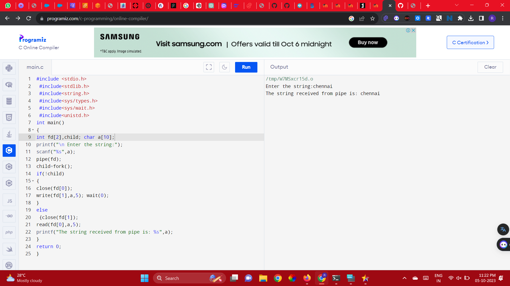

# OS-EX.6-IMPLEMENTATION-OF-INTER-PROCESS-COMMUNICATION-USING-PIPE

## AIM:

write C programs to illustrate IPC using pipes mechanisms.

## ALGORITHM:

1. Create a child process usingfork()
2. Create a simple pipe with C, we make use of the pipe() systemcall.
3. Create two file descriptor fd[0] is set up for reading, fd[1] is set up forwriting
4. Close the read end of parent process using close() and perform writeoperation
5. Close the write end of child process and performreading
6. Display thetext. 

## PROGRAM:
```
#include <stdio.h>
 #include<stdlib.h>
 #include<string.h>
 #include<sys/types.h>
 #include<sys/wait.h>
 #include<unistd.h>
int main()
{
int fd[2],child; char a[10];
printf("\n Enter the string:");
scanf("%s",a);
pipe(fd);
child=fork();
if(!child)
{
close(fd[0]);
write(fd[1],a,5); wait(0);
}
else
 {close(fd[1]);
read(fd[0],a,5);
printf("The string received from pipe is: %s",a);
}
return 0;
} 
```
## OUTPUT:



## RESULT:

Thus, IPC using pipes mechanisms is illustrated using c program successfully
